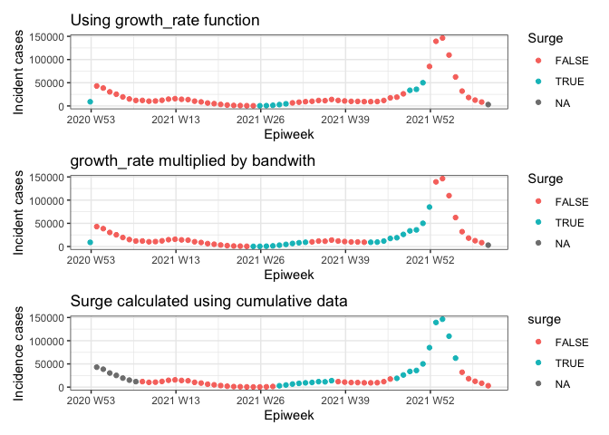

# Setting up


```r
library(here)
library(covidcast)
library(epiprocess)
library(tidyverse)
library(ggsci)
library(tsibble)
library(patchwork)
here::i_am(path = "notebooks/01-latest-upswings.Rmd")
source(here("R", "utils.R"))
(settings <- get_settings(start_date = "2021-01-01", end_date = "2022-03-01"))
```

```
## $h
## [1] 4
## 
## $upswing_thresh
## [1] 0.5
## 
## $min_thresh
## [1] 20
## 
## $start_date
## [1] "2021-01-01"
## 
## $end_date
## [1] "2022-03-01"
```

# Load data

For cumulative data, using confirmed cumulative numbers and aggregate by epiweek. For incidence data, using the 7-day average numbers.


```r
print("Cumulative data")
```

```
## [1] "Cumulative data"
```

```r
(df_cum <- covidcast_signal(data_source = "jhu-csse", 
                          signal = "confirmed_cumulative_num", 
                          start_day = settings$start_date, 
                          end_day = settings$end_date, 
                          geo_type = "state",
                          geo_values = c("ma"),
                          as_of = Sys.Date()) %>% 
        as_epi_df(geo_type = "state", time_type = "day", as_of = max(.$issue)) %>%
        select(geo_value, time_value, cases = value) %>% as_tsibble() %>% 
        index_by(epiweek = ~yearweek(., week_start = 7)) %>% 
        group_by(geo_value) %>% 
        summarize(cases = max(cases)) %>% ungroup() %>% 
        as_tibble() %>% dplyr::rename(time_value = epiweek) %>% 
        as_epi_df(geo_type = "state", time_type = "week"))
```

```
## Fetched day 2021-01-01 to 2022-03-01: num_entries = 425
```

```
## An `epi_df` object, with metadata:
## * geo_type  = state
## * time_type = week
## * as_of     = 2022-03-21 10:17:18
## 
## # A tibble: 62 × 3
##    geo_value time_value  cases
##  * <chr>         <week>  <dbl>
##  1 ma          2020 W53 384181
##  2 ma          2021 W01 427135
##  3 ma          2021 W02 465726
##  4 ma          2021 W03 496093
##  5 ma          2021 W04 521360
##  6 ma          2021 W05 540827
##  7 ma          2021 W06 555895
##  8 ma          2021 W07 567764
##  9 ma          2021 W08 579680
## 10 ma          2021 W09 589931
## # … with 52 more rows
```

```r
print("Incidence data")
```

```
## [1] "Incidence data"
```

```r
(df_inc <- covidcast_signal(data_source = "jhu-csse", 
                          signal = "confirmed_incidence_num", 
                          start_day = settings$start_date, 
                          end_day = settings$end_date, 
                          geo_type = "state",
                          geo_values = c("ma"),
                          as_of = Sys.Date()) %>% 
        as_epi_df(geo_type = "state", time_type = "day", as_of = max(.$issue)) %>% 
        select(geo_value, time_value, cases = value) %>% as_tsibble() %>%
        index_by(epiweek = ~yearweek(., week_start = 7)) %>% 
        group_by(geo_value) %>% 
        summarise(cases = sum(cases)) %>% ungroup() %>% 
        as_tibble() %>% dplyr::rename(time_value = epiweek) %>% 
        as_epi_df(geo_type = "state", time_type = "week")
        
)
```

```
## Fetched day 2021-01-01 to 2022-03-01: num_entries = 425
```

```
## An `epi_df` object, with metadata:
## * geo_type  = state
## * time_type = week
## * as_of     = 2022-03-21 10:17:19
## 
## # A tibble: 62 × 3
##    geo_value time_value cases
##  * <chr>         <week> <dbl>
##  1 ma          2020 W53  9003
##  2 ma          2021 W01 42954
##  3 ma          2021 W02 38591
##  4 ma          2021 W03 30367
##  5 ma          2021 W04 25267
##  6 ma          2021 W05 19467
##  7 ma          2021 W06 15068
##  8 ma          2021 W07 11869
##  9 ma          2021 W08 11916
## 10 ma          2021 W09 10251
## # … with 52 more rows
```


# Compute upswings on real data

The `rel_change` method in the `growth_rate` function from `epiprocess` defines relative change at focal time $T$ with bandwith $h$ as:

$$\frac{1}{h} * \left(\frac{\bar{B}}{\bar{A}} - 1\right) = \frac{1}{h} * \left(\frac{\bar{B} - \bar{A}}{\bar{A}}\right) = \\ \frac{1}{h} * \left(\frac{(h)^{-1}\left(\sum_{t = T+1}^{T + h} Y_t - \sum_{t = T+1-h}^{T} Y_t\right)}{(h)^{-1}\sum_{t = T+1-h}^{T} Y_t}\right) = \frac{1}{h} R^{h}_{T + h}$$

where $R_{T+h}^{h}$ is the **the actual** $h$-epiweek-incidence relative change as defined in notebook 7 on computing upswings on incidence data. Using the `rel_change` option in the `growth_rate` function from `epiprocess` with bandwidth being `h`.


```r
surge_inc <- df_inc %>% mutate(growth_raw = growth_rate(time_value, cases, method = "rel_change", 
                                                        h = settings$h), 
                  growth_adj = growth_raw * settings$h) %>%
    mutate(surge_raw = case_when(
        growth_raw >= settings$upswing_thresh & cases >= settings$min_thresh * settings$h ~ TRUE, 
        growth_raw < settings$upswing_thresh & cases >= settings$min_thresh * settings$h ~ FALSE,
        cases < settings$min_thresh * settings$h ~ NA
    )) %>% 
    mutate(surge_adj = case_when(
        growth_adj >= settings$upswing_thresh & cases >= settings$min_thresh * settings$h ~ TRUE, 
        growth_adj < settings$upswing_thresh & cases >= settings$min_thresh * settings$h ~ FALSE,
        cases < settings$min_thresh * settings$h ~ NA
    ))


p1 <- ggplot(surge_inc, aes(x = time_value, y = cases)) + geom_point(aes(col = surge_raw)) + theme_bw() + 
    labs(x = "Epiweek", y = "Incident cases", col = "Surge", title = "Using growth_rate function")
p2 <- ggplot(surge_inc, aes(x = time_value, y = cases)) + geom_point(aes(col = surge_adj)) + theme_bw() + 
    labs(x = "Epiweek", y = "Incident cases", col = "Surge", title = "growth_rate multiplied by bandwith")
```


```r
surge_cum <- df_cum %>% mutate(prev_cumulative = lag(cases, order_by = time_value, n = settings$h), 
    h_ew_inc = cases - prev_cumulative, 
    prev_h_ew_inc = lag(h_ew_inc, order_by = time_value, n = settings$h), 
    rel_change = (h_ew_inc - prev_h_ew_inc) / prev_h_ew_inc, 
    surge = case_when(
        rel_change >= settings$upswing_thresh & h_ew_inc >= settings$min_thresh * settings$h ~ TRUE,
        rel_change < settings$upswing_thresh & h_ew_inc >= settings$min_thresh * settings$h ~ FALSE,
        h_ew_inc < settings$min_thresh * settings$h ~ NA),
    prev_surge = lag(surge, order_by = time_value, n = settings$h), 
    cumulative = cases,
    inc = cases - lag(cases, order_by = time_value),
    target_end_date = time_value)

p3 <- surge_cum %>% 
    ggplot(aes(x = time_value, y = inc, col = surge)) + geom_point() + 
    theme_bw() + labs(x = "Epiweek", y = "Incidence cases", title = "Surge calculated using cumulative data") 

p1 / p2 / p3    
```

```
## Warning: Removed 1 rows containing missing values (geom_point).
```

<!-- -->


Unfortunately, using the cumulative formulation, the real values were lagged by a factor of `h`.  


```r
head(tibble(
    epiprocess = surge_inc$growth_adj,
    reference = surge_cum$rel_change
), n = 10)
```

```
## # A tibble: 10 × 2
##    epiprocess reference
##         <dbl>     <dbl>
##  1     4.49      NA    
##  2     0.125     NA    
##  3    -0.289     NA    
##  4    -0.407     NA    
##  5    -0.575     NA    
##  6    -0.568     NA    
##  7    -0.504     NA    
##  8    -0.371     NA    
##  9    -0.179     -0.575
## 10     0.0855    -0.568
```
However, once corrected by phase, the results seems to be identical between using `growth_rate` and the original cumulative code.  


