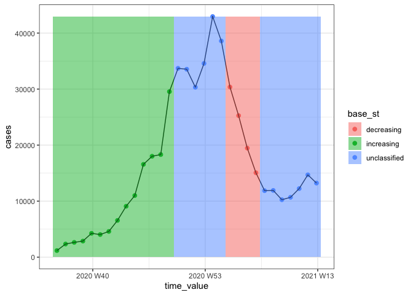
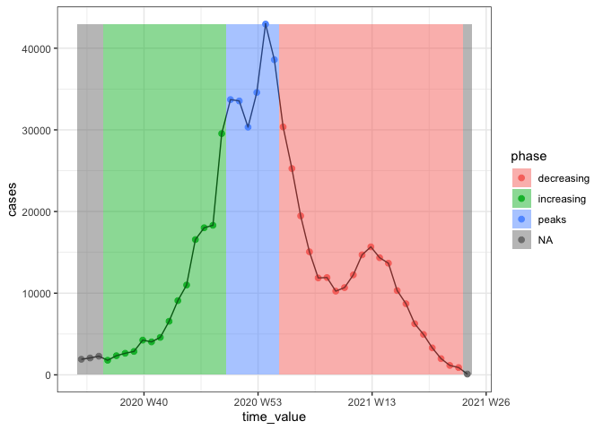

Comparing surge definition to CDC
================
Quang Nguyen
2022-03-21

## Data pre-loading and processing

``` r
library(here)
library(covidcast)
library(epiprocess)
library(tidyverse)
library(ggsci)
library(tsibble)
library(patchwork)
here::i_am(path = "notebooks/02-upswing-CDC.Rmd")
source(here("R", "utils.R"))
#(settings <- get_settings(start_date = "2020-06-01", end_date = "2022-03-01"))
```

Loading CDC Rt estimates

``` r
cdc_rt <- read_csv(file = here("data", "cdc_rt.csv")) %>% select(-1)
```

    ## New names:
    ## * `` -> ...1

    ## Rows: 48106 Columns: 15
    ## ── Column specification ────────────────────────────────────────────────────────
    ## Delimiter: ","
    ## chr   (3): state, type, version
    ## dbl  (10): ...1, median, mean, sd, lower_20, upper_20, lower_50, upper_50, l...
    ## lgl   (1): strat
    ## date  (1): date
    ## 
    ## ℹ Use `spec()` to retrieve the full column specification for this data.
    ## ℹ Specify the column types or set `show_col_types = FALSE` to quiet this message.

``` r
cdc_gr <- read_csv(file = here("data", "cdc_gr.csv")) %>% select(-1)
```

    ## New names:
    ## * `` -> ...1
    ## Rows: 42700 Columns: 15── Column specification ────────────────────────────────────────────────────────
    ## Delimiter: ","
    ## chr   (3): state, type, version
    ## dbl  (10): ...1, median, mean, sd, lower_20, upper_20, lower_50, upper_50, l...
    ## lgl   (1): strat
    ## date  (1): date
    ## ℹ Use `spec()` to retrieve the full column specification for this data.
    ## ℹ Specify the column types or set `show_col_types = FALSE` to quiet this message.

``` r
cdc_rt
```

    ## # A tibble: 48,106 × 14
    ##    state date       type  median  mean    sd lower_20 upper_20 lower_50 upper_50
    ##    <chr> <date>     <chr>  <dbl> <dbl> <dbl>    <dbl>    <dbl>    <dbl>    <dbl>
    ##  1 Alab… 2020-08-10 esti…   0.96  0.96  0.02     0.96     0.97     0.95     0.97
    ##  2 Alab… 2020-08-11 esti…   0.96  0.96  0.02     0.96     0.97     0.95     0.97
    ##  3 Alab… 2020-08-12 esti…   0.96  0.96  0.02     0.96     0.97     0.95     0.97
    ##  4 Alab… 2020-08-13 esti…   0.96  0.96  0.02     0.96     0.97     0.95     0.97
    ##  5 Alab… 2020-08-14 esti…   0.96  0.96  0.02     0.96     0.97     0.95     0.97
    ##  6 Alab… 2020-08-15 esti…   0.96  0.97  0.02     0.96     0.97     0.95     0.98
    ##  7 Alab… 2020-08-16 esti…   0.96  0.97  0.02     0.96     0.97     0.95     0.98
    ##  8 Alab… 2020-08-17 esti…   0.97  0.97  0.02     0.96     0.97     0.95     0.98
    ##  9 Alab… 2020-08-18 esti…   0.97  0.97  0.02     0.96     0.97     0.96     0.98
    ## 10 Alab… 2020-08-19 esti…   0.97  0.97  0.02     0.96     0.97     0.96     0.98
    ## # … with 48,096 more rows, and 4 more variables: lower_90 <dbl>,
    ## #   upper_90 <dbl>, version <chr>, strat <lgl>

``` r
start_date <- as.character(min(cdc_rt$date))
end_date <- as.character(max(cdc_rt$date))
h <- 4
surge_thresh <- 0.5
min_inc <- 20
```

``` r
print(paste("Computing surge data for state of MA from", start_date, "to", end_date))
```

    ## [1] "Computing surge data for state of MA from 2020-08-10 to 2021-06-14"

``` r
df <- covidcast_signal(data_source = "jhu-csse", 
                          signal = "confirmed_incidence_num", 
                          start_day = start_date, 
                          end_day = end_date, 
                          geo_type = "state",
                          geo_values = c("ma"),
                          as_of = Sys.Date()) %>% 
        as_epi_df(geo_type = "state", time_type = "day", as_of = max(.$issue)) %>% 
        select(geo_value, time_value, cases = value) %>% as_tsibble() %>%
        index_by(epiweek = ~yearweek(., week_start = 7)) %>% 
        group_by(geo_value) %>% 
        summarise(cases = sum(cases)) %>% ungroup() %>% 
        as_tibble() %>% dplyr::rename(time_value = epiweek) %>% 
        as_epi_df(geo_type = "state", time_type = "week")
```

    ## Fetched day 2020-08-10 to 2021-06-14: num_entries = 309

## Surge/Downswing computation

Compute upswing using growth_rate from epiprocess and use approximate
labels

``` r
df <- df %>% mutate(gr = growth_rate(y = cases, method = "rel_change", h = h) * h) %>% 
    mutate(base_st = case_when(
        gr >= surge_thresh & cases >= min_inc ~ "increasing",
        gr <= -surge_thresh & cases >= min_inc ~ "decreasing", 
        TRUE ~ "unclassified"
    ))


complete_lab <- df %>% filter(base_st != "unclassified") %>% as_tsibble() %>% tsibble::count_gaps() %>% 
    rowwise() %>%
    mutate(label = case_when(
        df %>% filter(time_value == .from - 1) %>% 
            pull(base_st) == "increasing" & 
        df %>% filter(time_value == .to + 1) %>% 
            pull(base_st) == "decreasing" ~ "peaks",
        
        df %>% filter(time_value == .from - 1) %>% 
            pull(base_st) == "decreasing" & 
        df %>% filter(time_value == .to + 1) %>% 
            pull(base_st) == "increasing" ~ "nadirs",
        
        df %>% filter(time_value == .from - 1) %>% 
            pull(base_st) == "decreasing" & 
        df %>% filter(time_value == .to + 1) %>% 
            pull(base_st) == "decreasing" ~ "decreasing",
        
                df %>% filter(time_value == .from - 1) %>% 
            pull(base_st) == "increasing" & 
        df %>% filter(time_value == .to + 1) %>% 
            pull(base_st) == "increasing" ~ "increasing"))


df <- df %>% mutate(phase = map2_chr(time_value, base_st, ~{
    if (.y != "unclassified"){
        return(.y)
    } else {
        lab <- complete_lab %>% filter(.x >= .from & .x <= .to) %>% 
            pull(label)
        if(length(lab) == 0){
            return(NA_character_)
        } else {
            return(lab)
        }
    }
}))
```

Plotting only increasing/decreasing/unclassified based on point
classification

``` r
ggplot(df, aes(x = time_value, y = cases)) + 
    geom_point(aes(col = base_st), size = 2) + geom_line() +  
    geom_rect(aes(ymin = 0, ymax = max(cases), xmin = time_value - 0.5, 
                  xmax = time_value + 0.5, fill = base_st), alpha = 0.5) +
    theme_bw()
```

<!-- -->

Plotting with correct phase assignment based on CDC document

``` r
ggplot(df, aes(x = time_value, y = cases)) + 
    geom_point(aes(col = phase), size = 2) + geom_line() +  
    geom_rect(aes(ymin = 0, ymax = max(cases), xmin = time_value - 0.5, 
                  xmax = time_value + 0.5, fill = phase), alpha = 0.5) +
    theme_bw()
```

<!-- -->

Reference image from CDC

``` r
knitr::include_graphics(here("imgs", "cdc_ref_ma.png"))
```

<!-- -->
