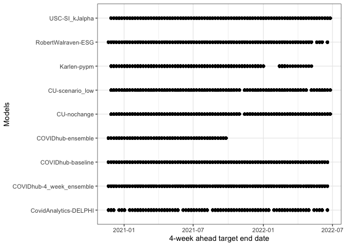
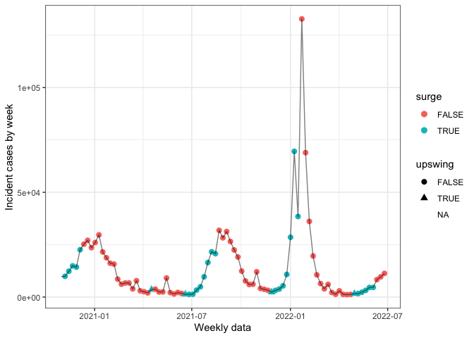
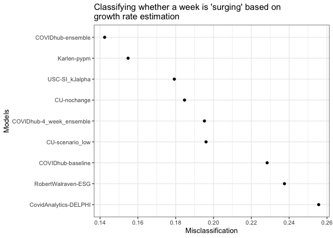
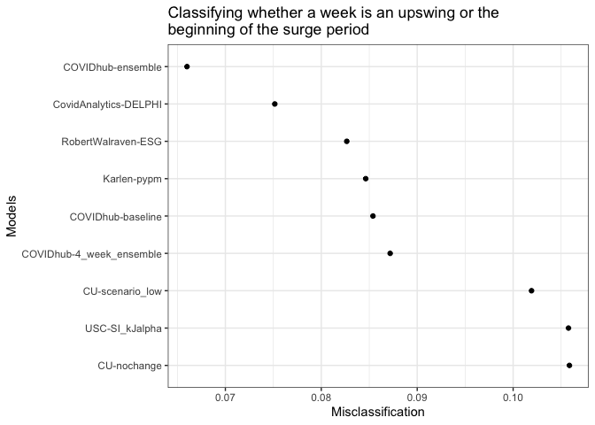
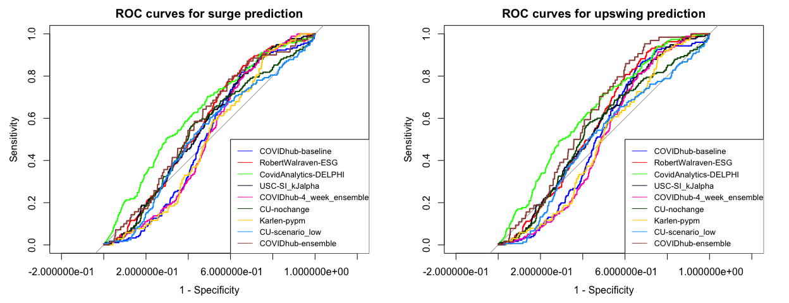
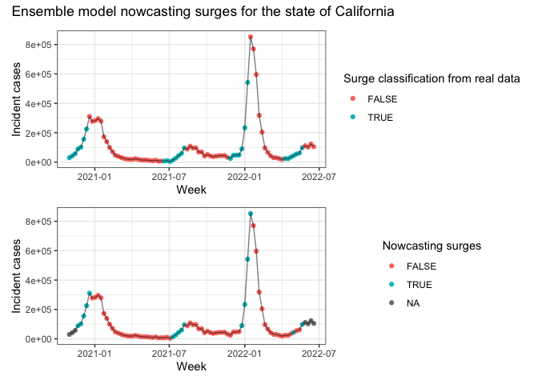
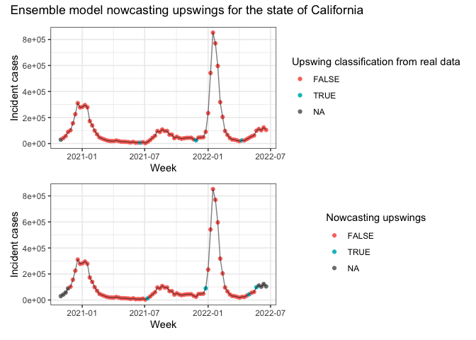

# Data pre-loading and processing


```r
library(here)
library(covidcast)
library(epiprocess)
library(zoltr)
library(tidyverse)
library(ggsci)
library(tsibble)
library(covidHubUtils)
library(lubridate)
library(rlang)
library(patchwork)
library(pROC)
here::i_am(path = "notebooks/multiple-forecaster.Rmd")
source(here("R", "utils.R"))
# (settings <- get_settings(start_date = "2020-06-01", end_date = "2022-03-01"))
theme_set(theme_bw())
```

First let's set some parameters and constants.  


```r
d_range <- seq(ymd("2020-11-01"), ymd("2022-06-01"), by = 7)
curr_date <- "2022-06-01"
h <- 4
wk_ahead <- 1
inc_case_targets <- paste(1:h, "wk ahead inc case")
surge_thresh <- 0.5
min_inc <- 20
```

# Loading forecasts and underlying data

Using `covidHubUtils` and `zoltar` we load underlying data as well as forecasts for models available in the US hub. Here we retrieve US states incident case forecasts 1-4 weeks in advance.  


```r
models <- c("COVIDhub-baseline", "RobertWalraven-ESG", "CovidAnalytics-DELPHI", "USC-SI_kJalpha", 
            "COVIDhub-4_week_ensemble", "CU-nochange", "Karlen-pypm", "CU-scenario_low", 
            "COVIDhub-ensemble")
if (!file.exists(here("data", "pred_data_20220608.rds"))){
    pred_case <- load_forecasts(
        models = models, 
        dates = d_range, 
        date_window_size = 6,
        locations = state.name, 
        types = "point", 
        targets = inc_case_targets, 
        source = "zoltar", 
        verbose = FALSE, 
        as_of = curr_date, 
        hub = c("US")
    )
    saveRDS(pred_case, file = here("data", "pred_data_20220608.rds"))
} else {
    pred_case <- readRDS(file = here("data", "pred_data_20220608.rds"))
}

ggplot(pred_case %>% filter(horizon == 4), aes(x = model, y = target_end_date)) + 
    geom_point() + 
    labs(x = "Models", y = "4-week ahead target end date") +
    coord_flip()
```

<!-- -->

Let's load the corresponding truth data  


```r
truth_data <- load_truth(
    truth_source = "JHU", 
    target_variable = "inc case", 
    locations = state.name
)

true_range <- pred_case %>% pull(target_end_date) %>% 
    unique() %>% 
    lubridate::as_date()

# convert truth_data to epi_df
truth_epidf <- truth_data %>% 
    select(-c(model, location, target_variable, location_name, 
              abbreviation, full_location_name)) %>% 
    dplyr::rename("time_value" = "target_end_date") %>%
    filter(time_value %in% true_range) %>%
    as_epi_df(geo_type = "state")

truth_epidf
```

```
## An `epi_df` object, with metadata:
## * geo_type  = state
## * time_type = day
## * as_of     = 2022-06-28 11:29:15
## 
## # A tibble: 4,350 × 5
##    geo_value time_value value population geo_type
##  * <chr>     <date>     <dbl>      <dbl> <chr>   
##  1 al        2020-10-31  9782    4903185 state   
##  2 al        2020-11-07  9905    4903185 state   
##  3 al        2020-11-14 12325    4903185 state   
##  4 al        2020-11-21 14865    4903185 state   
##  5 al        2020-11-28 14285    4903185 state   
##  6 al        2020-12-05 22596    4903185 state   
##  7 al        2020-12-12 25252    4903185 state   
##  8 al        2020-12-19 27063    4903185 state   
##  9 al        2020-12-26 23554    4903185 state   
## 10 al        2021-01-02 26000    4903185 state   
## # … with 4,340 more rows
```

# Surge classification using relative change growth rate formulation

We define surge for a given date using relative change growth rate formulation times the bandwidth using the implementation from `epiprocess`: 

$$\frac{1}{h} * \left(\frac{\bar{B}}{\bar{A}} - 1\right) = \frac{1}{h} * \left(\frac{\bar{B} - \bar{A}}{\bar{A}}\right) = \\ \frac{1}{h} * \left(\frac{(h)^{-1}\left(\sum_{t = T+1}^{T + h} Y_t - \sum_{t = T+1-h}^{T} Y_t\right)}{(h)^{-1}\sum_{t = T+1-h}^{T} Y_t}\right) = \frac{1}{h} R^{h}_{T + h}$$

A surge is defined for time-point $T$ as the difference in cumulative incident cases between the periods of $T+1$ and $T+h$ and $T$ and $T-h$. As such, an $h$-week ahead forecaster is a nowcaster of whether or not we're currently in a surge. Here, we classify for each week whether it is a surge based on it's $h$-week-ahead and $h$-week-prior data. An upswing is defined as the point at the beginning of a surge. Here we used the threshold of 50\% increase in cumulative difference in the $h$-week-ahead compared to $h$-week-prior data.


```r
truth_epidf <- truth_epidf %>% 
    mutate(gr = growth_rate(y = value, method = "rel_change", h = h) * h) %>%
    mutate(surge = case_when(
        gr >= surge_thresh & value >= min_inc ~ TRUE,
        TRUE ~ FALSE
    )) 

truth_epidf <- truth_epidf %>% 
    group_by(geo_value) %>% epi_slide(~{
        bef <- .x$surge[1]
        focal <- .x$surge[2]
        if (is.na(focal)){
            out <- NA
        } else {
            if (bef == FALSE & focal == TRUE){
                out <- TRUE
            } else if (bef == TRUE & focal == FALSE){
                out <- FALSE
            } else {
                out <- FALSE
            }
        }
        return(out)
}, n = 2 * 7 * 1, align = "right", new_col_name = "upswing")

ggplot(truth_epidf %>% filter(geo_value == "al"), aes(x = time_value, y = value)) +
    geom_point(aes(col = surge, shape = upswing), size = 2.5) + geom_line(alpha = 0.5) + 
    labs(x = "Weekly data", y = "Incident cases by week")
```

```
## Warning: Removed 1 rows containing missing values (geom_point).
```

<!-- -->

# Nowcasting surges    

Here we use the following procedures for a focal timepoint $T$ and bandwidth $h$ (for example, 4)  

1. We take a time period from $T+1- h$ to $T+h$. For example at 2021-01-23, we'd be taking the period from 2021-01-02 to 2021-02-20.     
2. We take the truth period to be from $T+1-h$ to $T$ (inclusive) and the forecasting period to be from $T+1$ to $T+h$. The truth period would have real underlying incident cases while the forecasting period has forecast incident cases at times 1-$h$ weeks ahead. Due to the forecasting date being on Monday instead of exactly one week before the proposed target date, we take forecast incident values from the forecast date closest to the time period defined at $T+1$. For example, at 2021-01-23, we would take forecast values for 2021-01-30 onwards from a forecast date of 2021-01-25.  
3. We compute the growth rate at time $T$ using these two periods as per the formula above   
4. We then classify periods as surges using the definition and thresholds defined above.  


```r
forecast <- pred_case %>% dplyr::rename("pred" = value, "time_value" = target_end_date)
actual <- truth_epidf %>% dplyr::rename("obs" = value)

combined <- left_join(actual, forecast) %>% 
    select(geo_value, population, geo_type, obs, pred, 
           time_value, forecast_date, model, horizon, surge, upswing)
```

```
## Joining, by = c("geo_value", "time_value", "population", "geo_type")
```

```r
combined <- combined %>% ungroup() %>% as_epi_df()
head(combined)
```

```
## # A tibble: 6 × 11
##   geo_value time_value population geo_type   obs  pred forecast_date model                    horizon surge upswing
##   <chr>     <date>          <dbl> <chr>    <dbl> <dbl> <date>        <chr>                    <chr>   <lgl> <lgl>  
## 1 ak        2020-10-31     731545 state     2812 1725  2020-10-26    COVIDhub-baseline        1       FALSE NA     
## 2 ak        2020-10-31     731545 state     2812 1557. 2020-10-26    RobertWalraven-ESG       1       FALSE NA     
## 3 ak        2020-10-31     731545 state     2812 1039  2020-10-26    CovidAnalytics-DELPHI    1       FALSE NA     
## 4 ak        2020-10-31     731545 state     2812 1664  2020-10-26    COVIDhub-4_week_ensemble 1       FALSE NA     
## 5 ak        2020-10-31     731545 state     2812 1664  2020-10-26    COVIDhub-ensemble        1       FALSE NA     
## 6 ak        2020-11-07     731545 state     2951 1725  2020-10-26    COVIDhub-baseline        2       FALSE FALSE
```


Let's define the slide function  


```r
# this function combines real case counts from time points t-h to t and forecasted 
# case counts from t+1 to t+h. Growth rate at time t is then estimated using the relative change 
# method
mismatch_slide <- function(slide_df, h){
    query_dates <- slide_df %>% pull(time_value) %>% unique() 
    req_len <- h * 2
    # if not enough weeks for prediction
    if (length(query_dates) != req_len){ 
        # this is an exception for when the dates are truncated at the end and beginning of the interval
        out <- NA_real_
    } else {
        # true dates, pred dates and ref dates 
        t_date <- query_dates[1:(req_len - h)]
        ref <- tail(t_date, n = 1)
        p_date <- query_dates[(req_len - h + 1):req_len]
        #print(query_dates)
        #print(ref)
        f_date <- slide_df %>% 
            filter(time_value == head(p_date, n = 1) & horizon == 1) %>%
            pull(forecast_date) %>% unique()
        
        if (length(f_date) == 0){
            # exceptions where there are no relevant forecasts for when the time step 1 ahead of 
            # the reference date
            out <- NA_real_
        } else {
            # get predicted values 
            pred <- slide_df %>% filter(forecast_date == f_date) %>% 
                dplyr::pull(pred)
            
            if (length(pred) < h){
                # this exception is when the model does not forecast $h$ weeks in advance 
                # (e.g. h = 4 but horizon only extends to 3)
                out <- NA_real_
            } else {
                # get true values 
                obs <- slide_df %>% filter(time_value %in% t_date) %>% 
                    select(time_value, obs) %>% 
                    distinct() %>% pull(obs)
                
                # put everything in an epi_df for posterity
                new_df <- tibble(
                    time_value = c(t_date, p_date), 
                    value = c(obs, pred), 
                    geo_value = "placeholder"
                ) %>% as_epi_df()
            
                out <- new_df %>% 
                    mutate(gr_pred = growth_rate(y = value, h = h, method = "rel_change") * h) %>% 
                    filter(time_value == ref) %>% pull(gr_pred)
            }
        }
    }
    return(out)
}
```

Let's use this with `epi_slide` function and loop through all the models  


```r
if (!file.exists(here("output", "calc_gr.rds"))){
    # this step takes about 20 minutes 
    begin <- Sys.time()
    gradient_calc <- combined %>% 
        group_by(geo_value, model) %>% 
        epi_slide(~mismatch_slide(.x, h = h), n = 2 * 7 * h, align = "center", new_col_name = "pred_gr") %>% 
        dplyr::ungroup() %>%
        dplyr::select(-c(forecast_date, horizon, pred)) %>% distinct()
    end <- Sys.time()
    print(end - begin)
    saveRDS(gradient_calc, file = here("output", "calc_gr.rds"))
} else {
    gradient_calc <- readRDS(file = here("output", "calc_gr.rds"))
}
```

Classify each time point as either a surge/upswing or not based on established criteria.  


```r
gradient_classif <- gradient_calc %>%
    mutate(surge_pred = case_when(
        pred_gr >= surge_thresh & obs >= min_inc ~ TRUE,
        is.na(pred_gr) ~ NA, 
        TRUE ~ FALSE
    )) %>% group_by(geo_value, model) %>% 
    epi_slide(~{
        bef <- .x$surge_pred[1]
        focal <- .x$surge_pred[2]
        if (is.na(focal) | is.na(bef)){
            out <- NA
        } else {
            if (bef == FALSE & focal == TRUE){
                out <- TRUE
            } else if (bef == TRUE & focal == FALSE){
                out <- FALSE
            } else {
                out <- FALSE
            }
        }
        return(out)
    }, n = 2 * 7 * 1, align = "right", new_col_name = "upswing_pred")
    

head(gradient_classif)
```

```
## # A tibble: 6 × 11
##   geo_value model                 time_value population geo_type   obs surge upswing pred_gr surge_pred upswing_pred
##   <chr>     <chr>                 <date>          <dbl> <chr>    <dbl> <lgl> <lgl>     <dbl> <lgl>      <lgl>       
## 1 ak        CovidAnalytics-DELPHI 2020-10-31     731545 state     2812 FALSE NA      NA      NA         NA          
## 2 ak        CovidAnalytics-DELPHI 2020-11-07     731545 state     2951 FALSE FALSE   NA      NA         NA          
## 3 ak        CovidAnalytics-DELPHI 2020-11-14     731545 state     3846 FALSE FALSE   NA      NA         NA          
## 4 ak        CovidAnalytics-DELPHI 2020-11-21     731545 state     4080 FALSE FALSE    0.346  FALSE      NA          
## 5 ak        CovidAnalytics-DELPHI 2020-11-28     731545 state     4225 FALSE FALSE    0.0266 FALSE      FALSE       
## 6 ak        CovidAnalytics-DELPHI 2020-12-05     731545 state     4829 FALSE FALSE   -0.258  FALSE      FALSE
```

Perform evaluation  


```r
surge_eval <- map_dfr(models, ~{
    misclass_surge <- gradient_classif %>% ungroup() %>% 
        filter(model == .x) %>% 
        filter(!is.na(surge_pred)) %>% 
        summarise(misclass = mean(surge != surge_pred), 
                  sens = sum(surge & surge_pred)/sum(surge), 
                  spec = sum(!surge & !surge_pred)/sum(!surge))
    pmod <- pROC::roc(surge ~ pred_gr, data = gradient_classif %>% filter(model == .x), 
                      subset = !is.na(surge_pred))
    misclass_surge <- mutate(misclass_surge, auc = round(as.numeric(pmod$auc),3), type = "surge")
    misclass_surge <- misclass_surge %>% mutate(model = .x)
        
})

upswing_eval <- map_dfr(models, ~{
    misclass_upswing <- gradient_classif %>% ungroup() %>% 
        filter(model == .x) %>% 
        filter(!is.na(upswing_pred)) %>% 
        summarise(misclass = mean(upswing != upswing_pred),
                  upswing_prev = mean(upswing),
                  sens = sum(upswing & upswing_pred)/sum(upswing), 
                  spec = sum(!upswing & !upswing_pred)/sum(!upswing))
    pmod <- pROC::roc(upswing ~ pred_gr, data = gradient_classif %>% filter(model == .x), 
                      subset = !is.na(upswing_pred))
    misclass_upswing <- mutate(misclass_upswing, auc = round(as.numeric(pmod$auc),3), type = "upswing")
    misclass_upswing <- misclass_upswing %>% mutate(model = .x)
        
})

saveRDS(upswing_eval, file = here("output", "upswing_eval.rds"))
saveRDS(surge_eval, file = here("output", "surge_eval.rds"))
knitr::kable(surge_eval)
```


|  misclass|      sens|      spec|   auc|type  |model                    |
|---------:|---------:|---------:|-----:|:-----|:------------------------|
| 0.2283544| 0.3076923| 0.9700036| 0.848|surge |COVIDhub-baseline        |
| 0.2375130| 0.2826283| 0.9575558| 0.796|surge |RobertWalraven-ESG       |
| 0.2556164| 0.2063179| 0.9510808| 0.542|surge |CovidAnalytics-DELPHI    |
| 0.1792767| 0.5835498| 0.9205539| 0.848|surge |USC-SI_kJalpha           |
| 0.1951899| 0.4167371| 0.9707264| 0.870|surge |COVIDhub-4_week_ensemble |
| 0.1846753| 0.5290043| 0.9380334| 0.842|surge |CU-nochange              |
| 0.1548223| 0.7113885| 0.8856873| 0.880|surge |Karlen-pypm              |
| 0.1960526| 0.4709507| 0.9459459| 0.836|surge |CU-scenario_low          |
| 0.1424390| 0.5243446| 0.9749340| 0.871|surge |COVIDhub-ensemble        |

```r
knitr::kable(upswing_eval)
```


|  misclass| upswing_prev|      sens|      spec|   auc|type    |model                    |
|---------:|------------:|---------:|---------:|-----:|:-------|:------------------------|
| 0.0853846|    0.0451282| 0.0568182| 0.9551557| 0.518|upswing |COVIDhub-baseline        |
| 0.0826558|    0.0436314| 0.0062112| 0.9589119| 0.575|upswing |RobertWalraven-ESG       |
| 0.0751515|    0.0463636| 0.0065359| 0.9694948| 0.637|upswing |CovidAnalytics-DELPHI    |
| 0.1057692|    0.0452183| 0.1954023| 0.9273272| 0.559|upswing |USC-SI_kJalpha           |
| 0.0871795|    0.0451282| 0.0511364| 0.9535446| 0.501|upswing |COVIDhub-4_week_ensemble |
| 0.1058667|    0.0466667| 0.1542857| 0.9303497| 0.541|upswing |CU-nochange              |
| 0.0846325|    0.0378619| 0.1176471| 0.9467593| 0.496|upswing |Karlen-pypm              |
| 0.1019178|    0.0413699| 0.0662252| 0.9339811| 0.502|upswing |CU-scenario_low          |
| 0.0660000|    0.0320000| 0.0156250| 0.9643595| 0.619|upswing |COVIDhub-ensemble        |

Visualize performance values  


```r
ggplot(surge_eval, aes(y = misclass, x = reorder(model, -misclass))) + 
    coord_flip() + geom_point() + 
    labs(x = "Models", y = "Misclassification", title = str_wrap("Classifying whether a week is 'surging' based on growth rate estimation", width = 50))
```

<!-- -->

```r
ggplot(upswing_eval, aes(y = misclass, x = reorder(model, -misclass))) + 
    coord_flip() + geom_point() + 
    labs(x = "Models", y = "Misclassification", title = str_wrap("Classifying whether a week is an upswing or the beginning of the surge period", width = 50))
```

<!-- -->

ROC curves for upswing and surge calculations  


```r
library(pals)
colors <- pals::glasbey(n = 9)

par(mfrow = c(1,2))

suppressMessages(mods <- map(models, ~{
    pROC::roc(upswing ~ pred_gr, data = gradient_classif %>% filter(model == .x), 
                  subset = !is.na(surge_pred), verbose = FALSE)
}))
names(mods) <- models
plot(mods[[1]], col = colors[1], legacy.axes = TRUE, main = "ROC curves for surge prediction")
for (i in 2:length(mods)){
    plot(mods[[i]], add = TRUE, col = colors[i])
}

legend(0.4,0.5,legend=models, col = colors, lty = 1, cex = 0.8)


suppressMessages(mods <- map(models, ~{
    pROC::roc(upswing ~ pred_gr, data = gradient_classif %>% filter(model == .x), 
                  subset = !is.na(upswing_pred), verbose = FALSE)
}))
names(mods) <- models
plot(mods[[1]], col = colors[1], legacy.axes = TRUE, main = "ROC curves for upswing prediction")
for (i in 2:length(mods)){
    plot(mods[[i]], add = TRUE, col = colors[i])
}
legend(0.4,0.5,legend=models, col = colors, lty = 1, cex = 0.8)
```

<!-- -->


# Ensemble only evaluation   


```r
ensemble <- gradient_classif %>% filter(model == models[5]) 

p1 <- ggplot(ensemble %>% filter(geo_value == "ca"), 
       aes(x = time_value, y = obs)) + geom_point(aes(col = surge)) + geom_line(alpha = 0.5) + 
    labs(x = "Week", col = "Surge classification from real data", y = "Incident cases")
p2 <- ggplot(ensemble %>% filter(geo_value == "ca"), aes(x = time_value, y = obs)) + 
    geom_point(aes(col = surge_pred)) + 
    geom_line(alpha = 0.5) + 
    labs(x = "Week", col = "Nowcasting surges", y = "Incident cases")
p1 / p2 + plot_annotation("Ensemble model nowcasting surges for the state of California")
```

<!-- -->

Plotting incident cases and surge classification   


```r
p1 <- ggplot(ensemble %>% filter(geo_value == "ca"), 
             aes(x = time_value, y = obs)) +
    geom_point(aes(col = upswing)) + 
    geom_line(alpha = 0.5) + 
    labs(x = "Week", col = "Upswing classification from real data", y = "Incident cases")
p2 <- ggplot(ensemble %>% filter(geo_value == "ca"), aes(x = time_value, y = obs)) + 
    geom_point(aes(col = upswing_pred)) + 
    geom_line(alpha = 0.5) + 
    labs(x = "Week", col = "Nowcasting upswings", y = "Incident cases")

p1 /p2 + plot_annotation(title = "Ensemble model nowcasting upswings for the state of California")
```

<!-- -->
